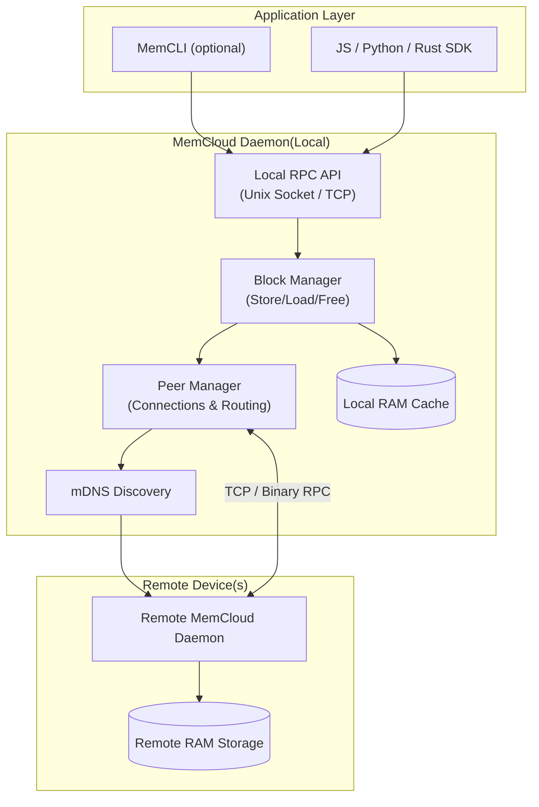

# MemCloud ☁️


[](https://www.npmjs.com/package/memcloud)
[](https://opensource.org/licenses/MIT)
[](https://github.com/vibhanshu2001/memcloud/actions)
[](http://makeapullrequest.com)

**MemCloud** is a distributed in-memory data store written in Rust. It allows nodes (such as macOS and Linux machines) on a local network to pool their RAM, creating a shared, ephemeral storage cloud.

> *"Turning nearby devices into your personal RAM farm."*

---

## 📚 Table of Contents

- [Key Features](#-key-features)
- [Why MemCloud?](#-why-memcloud)
- [Quick Start](#-quick-start)
- [Roadmap](#-roadmap)
- [Architecture](#-architecture)
- [Comparison](#-comparison)
- [Installation](#-installation)
- [Usage (CLI)](#-usage)
- [Usage (JS SDK)](#-5-js-sdk-usage)
- [Distribution](#-distribution--publishing)
- [Contributing](#-contributing)
- [License](#-license)

---

## 💡 Why MemCloud?

**Problem**: You have 32GB RAM on your laptop, but your local Node.js script crashes with OOM because it's processing a 2GB log file and trying to buffer it. Meanwhile, your idle desktop next to you has 64GB RAM doing nothing.

**Solution**: MemCloud lets you treat that idle desktop's RAM as an extension of your own. It's not just a cache; it's a way to **offload memory pressure** from your active development machine to other devices on your local network.

**Use Cases**:
*   **Distributed Local Caching**: Share build artifacts or ML model weights across your team's devices on the same LAN.
*   **"Infinite" RAM Streams**: Stream gigabytes of data to a peer node for temporary storage, keeping your local process footprint tiny.
*   **Ephemeral scratchpad**: Quick, zero-config storage that disappears when you reboot (perfect for dev/test data).

---

## 🚀 Quick Start

### 1. Install & Start
```bash
# Install on all your machines
curl -fsSL https://raw.githubusercontent.com/vibhanshu2001/memcloud/main/install.sh | sh

# Start the node (it automatically finds peers via mDNS)
memcli node start --name "MyDevice"
```

### 2. Store Data (Rust & CLI)
```bash
# Simple Key-Value
memcli set "greeting" "Hello from MemCloud!"
# -> Set 'greeting' (Block ID: 882211)

memcli get "greeting"
# -> "Hello from MemCloud!"
```

### 3. Usage (JavaScript/TypeScript)
```typescript
import { MemCloud } from 'memcloud';

const cloud = new MemCloud();
await cloud.connect();

// 1. Store
await cloud.set("user:123", JSON.stringify({ name: "Alice", role: "admin" }));

// 2. Get
const user = await cloud.get("user:123");
console.log(JSON.parse(user.toString())); 

// 3. Offload Stream (Zero RAM usage on client)
const hugeFile = fs.createReadStream('./huge.log');
const handle = await cloud.storeStream(hugeFile);
```

---

## 🔥 Key Features

| Feature | Description |
|---------|-------------|
| **Distributed RAM Pooling** | Combine idle RAM from multiple devices on your LAN |
| **Zero-Config Discovery** | Automatic peer discovery via mDNS — no manual IP setup |
| **Millisecond Latency** | Store/load data across devices in < 10ms on local network |
| **Multi-Device Support** | Works with macOS, Ubuntu, and other Linux distros |
| **Works Offline** | Fully functional over LAN without internet connection |
| **CLI + SDKs** | Command-line interface, Rust SDK, and TypeScript/JS SDK |
| **Daemon Mode** | Run as background service with `memcli node start` |
| **Key-Value Store** | `set(key, value)` and `get(key)` in addition to raw blocks |

---

## 🛣️ Roadmap

- [x] Local RPC API (Unix Socket + JSON TCP)
- [x] Rust SDK (`memsdk`)
- [x] NPM/TypeScript SDK (`memcloud`)
- [x] CLI daemon management (`memcli node start/stop/status`)
- [ ] Block replication (store on 2+ devices for redundancy)
- [ ] Memory pressure handling & eviction policies
- [ ] Python SDK
- [ ] LLM KV-cache offloading integration
- [ ] Homebrew formula
- [ ] .deb/.rpm system packages

---

## 🏗️ Architecture

See [docs/architecture.md](./docs/architecture.md) for detailed diagrams and data flow.



**Project Structure:**
- `memnode/` — The core daemon running on each machine
- `memsdk/` — Rust SDK Library
- `memcli/` — Command-line client
- `js-sdk/` — TypeScript SDK (published as `memcloud` on npm)
- `installers/` — Systemd/Launchd service files

## 🔒 Security & Authentication

MemCloud employs a **Secure Session Protocol** (inspired by **Noise Protocol XX Pattern**) with **Transcript Hashing** to ensure data security on your LAN.

1.  **Identity Keys**: Persistent Ed25519 identity keypair required for all nodes.
2.  **Handshake (Transcript-Hashed)**:
    *   **Hello**: Nodes exchange nonces and ephemeral X25519 public keys.
    *   **Transcript Binding**: Every message is hashed into a running transcript.
    *   **Auth**: Nodes exchange **encrypted** proofs of identity (Signature of the Transcript).
    *   **Session**: Traffic keys are derived from the shared secret + transcript hash, ensuring forward secrecy and strong unique session binding.
3.  **Encryption**: All traffic (including the Auth phase) is encrypted using **ChaCha20-Poly1305** (AEAD).

**Zero-Configuration**: By default, MemCloud uses a Trust-On-First-Use (TOFU) model with an interactive consent layer.
*   **First Connect**: The receiving user is prompted to Allow (Once), Trust (Always), or Deny.
*   **Trusted**: If "Trust Always" is selected, the device is added to `~/.memcloud/trusted_devices.json` and future connections are automatic.
*   **Untrusted**: Connections are paused until approved via the CLI.

---


## ⚖️ Feature Matrix

| Feature | MemCloud | Redis | Memcached |
| :--- | :--- | :--- | :--- |
| **Core Value** | Pools Idle RAM on local machines. | Feature-rich in-memory database. | Simple key-value caching. |
| **Architecture** | **P2P** / Mesh (mDNS Discovery) | Client-Server | Client-Server |
| **Data Structures** | Strings (Key-Value) | Strings, Hashes, Lists, Sets, etc. | Strings |
| **Persistence** | None (Ephemeral Cache) | RDB/AOF (Optional) | None |
| **Ideal Use Case** | **Shared local dev/ML caching** and task distribution. | Session store, message broker, complex caching. | Simple, high-throughput string caching. |

### Performance Philosophy
**The Unique Advantage: Local P2P**
While Redis and Memcached shine as single-instance servers, MemCloud is designed for **distributed local caching**.

**Scenario**: 
-   **MemCloud**: Client A writes to Node B; Client B reads from Node B. (Simulating team task sharing).
-   **Advantage**: Latency is bound primarily by your fast local network (LAN) and the lightweight Rust daemon, utilizing idle resources across *all* connected machines rather than contending for a single server instance.

### ⚡️ Performance Benchmarks (Localhost)
MemCloud is built for speed, leveraging Rust's zero-cost abstractions and Tokio's async runtime.

| System | SET (ops/sec) | GET (ops/sec) | Note |
| :--- | :--- | :--- | :--- |
| **MemCloud** | **25,545** | **16,704** | Measured with 1KB payloads |
| Redis | ~28,000* | ~30,000* | *Reference values for unoptimized local instance* |
| Memcached | ~35,000* | ~40,000* | *Reference values* |

*(Benchmark run on MacBook Air M1, 10k ops, single client)*

### 🛠️ Use Case: "Infinite RAM" Log Archiver

**Problem**: A log pipeline generates **1GB** of access logs. Buffering this in Node.js would crash the process (OOM).

**Solution**: Stream data directly to a MemCloud Peer.

**Results**:
- **Total Processed**: 1,000,000 Logs (1GB Raw)
- **Compression**: Real-time Gzip
- **Peak Local RAM Usage**: **129 MB** (Stable) 🤯

> "MemCloud allowed us to process infinite streams of data using tiny, low-memory containers by offloading storage to the cluster."

## Installation

### Prerequisites
- Node.js (for JS SDK)

### Quick Install (macOS & Linux)
To install MemCloud without cloning the repo, simply run:
```bash
curl -fsSL https://raw.githubusercontent.com/vibhanshu2001/memcloud/main/install.sh | sh
```
This will download the latest binary for your architecture and install it to `/usr/local/bin`.

### Quick Install (Windows)
Run this in PowerShell:
```powershell
irm https://raw.githubusercontent.com/vibhanshu2001/memcloud/main/install.ps1 | iex
```


### Build from Source
```bash
git clone https://github.com/vibhanshu2001/memcloud.git
cd memcloud
cargo build --release
```

Binaries will be available in `target/release/`:
* `memnode`: The daemon service.
* `memcli`: The command-line client.

## Usage

### 1. Start the Daemon (Easy Mode)
Use `memcli` to manage the node as a background service:

```bash
# Start node in background
memcli node start --name "MacBookPro" --port 8080
# 🚀 Starting MemCloud node 'MacBookPro' on port 8080...
# ✅ Node started successfully (PID: 12345)

# Check status
memcli node status
# ✅ MemCloud node is running (PID: 12345)

# Stop the node
memcli node stop
# 🛑 Stopping MemCloud node (PID: 12345)...
# ✅ Node stopped.

# View logs
memcli logs -f
```

### 2. Start the Daemon (Manual Mode)
For debugging or foreground operation:
```bash
# On Machine A
memnode --name "NodeA" --port 8080

# On Machine B
memnode --name "NodeB" --port 8081
```

### 3. Connect Peers (One-time)
If mDNS discovery doesn't automatically find peers (e.g. different subnets), use manual connect:
```bash
# On NodeA, connect to NodeB
memcli connect <IP_OF_NODE_B>:8081
```

### 4. CLI Operations

> **Note**: For a comprehensive command reference, see the [CLI Documentation](https://memcloud.vercel.app/docs/cli).

**Store Data:**
```bash
# Store locally (or auto-distributed)
memcli store "Hello World"
# Output: Stored block ID: 123456789

# Store on specific peer
memcli store "Sensitive Data" --peer "NodeB"

# Set a Key-Value Pair
memcli set "app-config" "{\"theme\": \"dark\"}"
# Output: Set 'app-config' -> {"theme": "dark"} (Block ID: 556677)

# Get a Key-Value Pair
memcli get "app-config"

# List Keys (Redis-style patterns)
memcli keys "*"          # List all
memcli keys "user:*"     # List starting with 'user:'
memcli keys "*config"    # List ending with 'config'
```

**Load Data:**
```bash
memcli load 123456789
```

**Peer Operations:**
```bash
# List all connected peers
memcli peer list

# Connect (Interactive Mode - prompts for Quota)
memcli connect <IP>:8080

# Connect with manual RAM quota (non-interactive)
memcli connect <IP>:8080 --quota "512mb"

# Update an active peer's quota (Live) - supports Name or ID
memcli peer update <NAME_OR_ID> --quota "1gb"

# Disconnect from a peer
memcli peer disconnect <NAME_OR_ID>

# Manage Trust
memcli trust list                  # List trusted devices
memcli trust remove <NAME_OR_ID>   # Remove a device from trust store
memcli consent                     # Interactive prompt for pending requests
```

**Show Stats:**
```bash
memcli stats
```

**Stream Data:**
```bash
# Stream from file
memcli stream /path/to/access.log

# Stream from stdin
tail -f access.log | memcli stream
```

### 5. JS SDK Usage

Install the SDK:
```bash
npm install memcloud
```

Example usage:
```typescript
import { MemCloud } from 'memcloud';

const cloud = new MemCloud();

async function main() {
    await cloud.connect();

    // Store and retrieve data
    const handle = await cloud.store("My Data");
    console.log("Stored ID:", handle.id);

    const data = await cloud.load(handle.id);
    console.log("Data:", data.toString());

    // Key-Value Store
    await cloud.set("app-config", JSON.stringify({ theme: "dark" }));
    const config = await cloud.get("app-config");
    console.log("Config:", JSON.parse(config.toString()));

    // List peers
    const peers = await cloud.peers();
    console.log("Peers:", peers);

    cloud.close();
}

main();
```

### 6. 🌊 Data Streaming (Infinite RAM)
Process large datasets without memory spikes by streaming them directly to a peer.

```typescript
import { createReadStream } from 'fs';

// Stream a 1GB file directly to MemCloud
// Local RAM usage stays low (<50MB) regardless of file size
const stream = createReadStream('./massive-log.txt');
const handle = await cloud.storeStream(stream);

console.log("Stored Stream ID:", handle.id);
```

See `js-sdk/README.md` for full API documentation.

## Uninstallation

To completely remove MemCloud from your system:

```bash
curl -fsSL https://raw.githubusercontent.com/vibhanshu2001/memcloud/main/uninstall.sh | sh
```

This will:
- Stop the running daemon (if any)
- Remove `memnode` and `memcli` from `/usr/local/bin`
- Optionally remove the `~/.memcloud/` config directory

To uninstall the JS SDK:
```bash
npm uninstall memcloud
```

## Distribution & Publishing

### Ubuntu/Debian (.deb)
We support generating `.deb` packages via `cargo-deb`:
1. Install tool: `cargo install cargo-deb`
2. Build Package:
   ```bash
   cargo deb -p memnode
   cargo deb -p memcli
   ```
3. Install:
   ```bash
   sudo apt-get install ./target/debian/memnode_*.deb ./target/debian/memcli_*.deb
   ```
   *Note: Installing `memnode` automatically sets up the systemd service.*


## 🤝 Contributing

We love plugins, bug fixes, and feature requests!
Please read our [CONTRIBUTING.md](./CONTRIBUTING.md) for details on our code of conduct and the process for submitting pull requests.

1.  Fork the Project
2.  Create your Feature Branch (`git checkout -b feature/AmazingFeature`)
3.  Commit your Changes (`git commit -m 'feat: Add some AmazingFeature'`)
4.  Push to the Branch (`git push origin feature/AmazingFeature`)
5.  Open a Pull Request

## License
MIT
