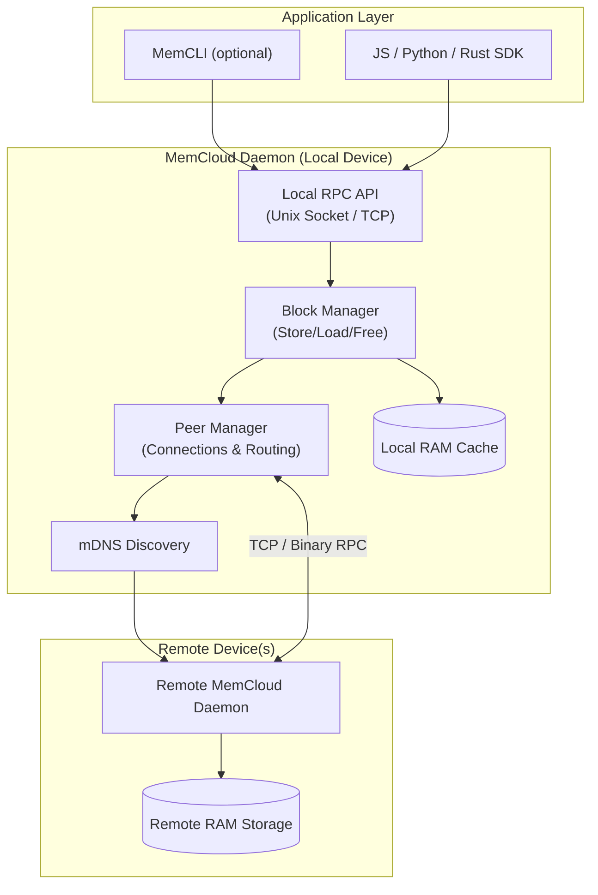

# MemCloud ☁️

**MemCloud** is a distributed in-memory data store written in Rust. It allows nodes (such as macOS and Linux machines) on a local network to pool their RAM, creating a shared, ephemeral storage cloud.

## 🏗️ Architecture

1.  **MemNode**: The core daemon running on each machine. It handles storage, networking, and discovery.
- `memsdk/`: Rust & C SDK Library.
- `memcli/`: The command-line client.
- `js-sdk/`: TypeScript SDK.
- `installers/`: Systemd/Launchd scripts.

## Features

- **Distributed Storage**: Seamlessly store and retrieve data blocks across peers.
- **Bi-Directional Sync**: Nodes can push data or fetch data from remote peers silently.
- **Named Peers**: Assign names to your nodes (e.g., "MacBook", "UbuntuBox") for easy targeting.
- **Key-Value Store**: Support for `set(key, value)` and `get(key)` in addition to raw block IDs.
- **JS SDK**: A TypeScript SDK for building Node.js applications on top of MemCloud.
- **CLI**: A powerful command-line interface for interaction and debugging.

## Installation

### Prerequisites
- Node.js (for JS SDK)

### Quick Install (macOS & Linux)
To install MemCloud without cloning the repo, simply run:
```bash
curl -fsSL https://raw.githubusercontent.com/vibhanshu2001/memcloud/main/install.sh | sh
```
This will download the latest binary for your architecture and install it to `/usr/local/bin`.


### Build from Source
```bash
git clone https://github.com/vibhanshugarg/memcloud.git
cd memcloud
cargo build --release
```

Binaries will be available in `target/release/`:
* `memnode`: The daemon service.
* `memcli`: The command-line client.

## Usage

### 1. Start the Daemon
Runs the node. Use `--name` to identify this machine.
```bash
# On Machine A
./target/release/memnode --name "NodeA" --port 8080

# On Machine B
./target/release/memnode --name "NodeB" --port 8081
```

### 2. Connect Peers (One-time)
If mDNS discovery doesn't automatically find peers (e.g. different subnets), use manual connect:
```bash
# On NodeA, connect to NodeB
./target/release/memcli connect <IP_OF_NODE_B>:8081
```

### 3. CLI Operations

**Store Data:**
```bash
# Store locally (or auto-distributed)
./target/release/memcli store "Hello World"
# Output: Stored block ID: 123456789

# Store on specific peer
./target/release/memcli store "Sensitive Data" --peer "NodeB"

# Set a Key-Value Pair
# (CLI support for KV coming soon, currently supported in SDK)
```

**Load Data:**
```bash
./target/release/memcli load 123456789
```

**List Peers:**
```bash
./target/release/memcli peers
```

### 4. JS SDK Usage
See `js-sdk/` for full code.

```typescript
import { MemCloud } from 'memcloud-sdk';

const cloud = new MemCloud(); // Defaults to /tmp/memcloud.sock

async function main() {
    await cloud.connect();

    // Store raw data
    const handle = await cloud.store("My Data");
    console.log("Stored ID:", handle.id);

    // KV Store
    await cloud.set("app-config", JSON.stringify({ theme: "dark" }));
    
    // Retrieve
    const config = await cloud.get("app-config");
    console.log("Config:", config.toString());
}

main();
```

## Distribution & Publishing

### Ubuntu/Debian (.deb)
We support generating `.deb` packages via `cargo-deb`:
1. Install tool: `cargo install cargo-deb`
2. Build Package:
   ```bash
   cargo deb -p memnode
   cargo deb -p memcli
   ```
3. Install:
   ```bash
   sudo apt-get install ./target/debian/memnode_*.deb ./target/debian/memcli_*.deb
   ```
   *Note: Installing `memnode` automatically sets up the systemd service.*


## License
MIT
