# MemCloud Architecture

This document describes the internal architecture of MemCloud, including data flows for core operations.

---

## System Overview


---

## Data Flow: STORE Operation

When a client stores data:


---

## Data Flow: LOAD Operation

When a client loads data:


---

## Peer Discovery Flow

MemCloud uses mDNS (Multicast DNS) for automatic peer discovery on the local network:


---

## Module Structure

```
memcloud/
├── memnode/                 # Core daemon
│   ├── src/
│   │   ├── main.rs          # Entry point, CLI args
│   │   ├── blocks/          # Block storage & management
│   │   ├── discovery/       # mDNS peer discovery
│   │   ├── net/             # TCP transport layer
│   │   ├── peers/           # Peer connection management
│   │   ├── rpc/             # Local RPC server (Unix socket + JSON TCP)
│   │   └── metadata/        # Block metadata & indexing
│   └── Cargo.toml
│
├── memsdk/                  # Rust SDK
│   ├── src/lib.rs           # Client API
│   └── Cargo.toml
│
├── memcli/                  # Command-line interface
│   ├── src/main.rs          # CLI commands (store, load, peers, node)
│   └── Cargo.toml
│
├── js-sdk/                  # TypeScript SDK (npm: memcloud)
│   ├── src/
│   │   ├── api.ts           # MemCloud class
│   │   └── socket.ts        # TCP/Unix socket transport
│   └── package.json
│
└── installers/              # Service files
    ├── macos/               # launchd plist
    └── linux/               # systemd service
```

---

## Wire Protocol

### Local RPC (JSON over TCP/Unix Socket)

All local communication uses length-prefixed JSON:

```
┌────────────────┬────────────────────────────┐
│ Length (4 bytes, big-endian) │ JSON Body  │
└────────────────┴────────────────────────────┘
```

**Example Commands:**
```json
// Store
{ "Store": { "data": [72, 101, 108, 108, 111] } }

// Load
{ "Load": { "id": 12345678 } }

// Set Key-Value
{ "Set": { "key": "my-key", "data": [1, 2, 3] } }

// Get Key-Value
{ "Get": { "key": "my-key" } }

// List Peers
"ListPeers"
```

### Peer-to-Peer Protocol (Binary)

Inter-node communication uses a binary protocol with `bincode` serialization for efficiency:

```rust
enum Message {
    Hello { node_id: Uuid, name: String },
    StoreBlock { id: u64, data: Vec<u8> },
    RequestBlock { id: u64 },
    BlockData { id: u64, data: Vec<u8> },
    SetKey { key: String, data: Vec<u8> },
    GetKey { key: String },
    KeyFound { key: String, data: Option<Vec<u8>> },
    Ping,
    Pong,
}
```

---

## 🔒 Security & Authentication

MemCloud implements a **Noise-based (XX) Secure Protocol** over TCP.

### Key Features
*   **Transcript Hashing**: All handshake messages are hashed into a running state (`Transcript`).
*   **Signature Binding**: Signatures sign the *Transcript Hash*, not just a nonce, preventing parameter tampering (MITM).
*   **Encrypted Identities**: Identity public keys and names are exchanged only *after* an encrypted tunnel is established via ephemeral keys.
*   **Forward Secrecy**: Ephemeral X25519 keys are generated for every session.

### Authentication Flow (Noise XX)

```mermaid
sequenceDiagram
    participant A as Node A (Initiator)
    participant B as Node B (Responder)

    Note over A,B: TCP Connection

    rect rgb(255, 255, 240)
    Note right of A: 1. Hello (Cleartext)
    A->>B: [HELLO] Nonce_A, Ephemeral_Pub_A, Quota
    Note over A,B: Mix Hash(HelloA)
    end

    rect rgb(255, 255, 240)
    Note right of B: 2. Hello (Cleartext)
    B->>A: [HELLO] Nonce_B, Ephemeral_Pub_B, Quota
    Note over A,B: Mix Hash(HelloB)
    Note over A,B: Derive Handshake Keys (ECDH)
    end

    rect rgb(230, 255, 230)
    Note right of A: 3. Auth A (Encrypted)
    A->>B: Encrypt([AUTH] Identity_A, Signature_A(Transcript))
    Note over A,B: Mix Hash(AuthA)
    end

    rect rgb(230, 255, 230)
    Note right of B: 4. Auth B (Encrypted)
    B->>A: Encrypt([AUTH] Identity_B, Signature_B(Transcript))
    Note over A,B: Mix Hash(AuthB)
    end

    Note over A,B: Derive Traffic Keys (Split Direction)
    Note over A,B: 🔒 Secure Session Establised
```


